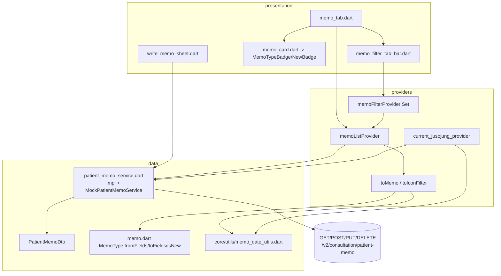
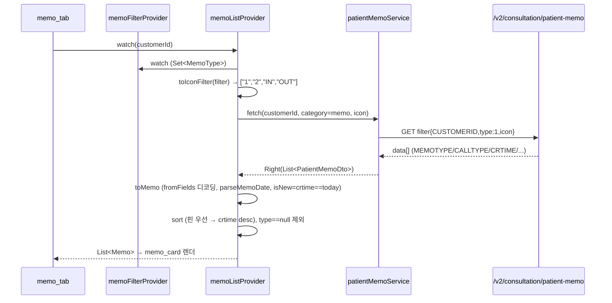
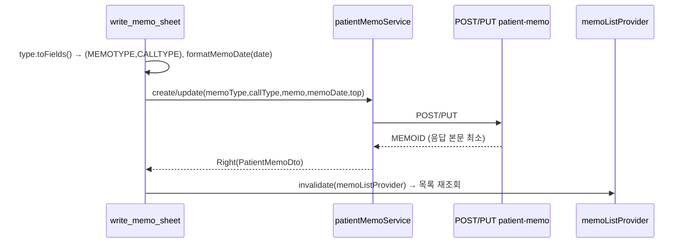

# 2026-06-06 · 메모 탭 실서버 이관 (MemoService → patient-memo) + 유형필터/날짜/New 정리

## 1. 개요
- 날짜: 2026-06-06
- 프로젝트 / 화면 / 모듈: devops-mediclo / 진료실(메모) `MC_ID_9` / `features/consultation`
- 이슈 유형: 기능 구현(실서버 연동) + 버그 수정(필터·날짜·정렬)
- 계층: 클라이언트(상태관리/모델) + API·네트워크(patient-memo)
- 최종 상태: 해결 (메모 탭 실서버 연동 완료, `flutter analyze` error 0)
- 중요도: 높음

## 2. 환경
- OS / 기기: Linux, 대상 태블릿(Galaxy Tab SM X510 등)
- 앱: Flutter (Dart ^3.10.4), Clean Architecture + Feature-First
- 브랜치 / 커밋: `develop`
  - `41da304` 메모 탭 실서버 이관 + 유형필터 BUG-002
  - `0391104` 날짜버그·파싱통일·crtime 정렬 + New(오늘작성) 재정의
- 관련 의존성: flutter_riverpod, dio, fpdart(Either), freezed

## 3. 증상
### 관찰된 현상
- 주소증 탭은 `patient-memo` 실서버에 붙어 있는데 **메모 탭만 실서버 미연동** — 항상 Mock 데이터만 표시.
- (이관 후 발견) 주소증 날짜가 **항상 "오늘"로 표시**되고, 저장 시 날짜 포맷이 서버와 불일치.
- 유형 필터에서 마지막 1개 유형을 끄면 의도와 다르게 "전체"로 돌아감.

### 재현 절차
1. 실서버 모드로 메모 탭(현황판 > 스케줄 > 메모) 진입 → Mock 고정(실데이터 안 옴)
2. 주소증 탭에서 과거 날짜 메모 확인 → 작성일이 오늘로 표시
3. 메모 유형 필터에서 단일 선택 후 그 유형 재탭 → 전체로 fallback

### 에러 메시지 / 로그 (원문)
```text
(런타임 에러 아님 — 기능 미연동/로직 버그. analyze 는 변경 전후 모두 메모 영역 clean)
```

## 4. 확인한 내용
- `memo_providers.dart` 의 `memoServiceProvider` 가 mock/non-mock 무관하게 항상 `MockMemoService` 반환 (`TODO(real)`).
- 같은 API 를 쓰는 주소증은 `patientMemoServiceProvider` → `PatientMemoServiceImpl` 로 실연동.
- MC_ID 레지스트리: `MC_ID_9(메모)` = `GET /v2/consultation/patient-memo` (#21~24), 주소증/기타와 API 공유.
- 단순 provider 교체가 안 되는 이유: 메모 4종(메모1/메모2/인콜/아웃콜)이 `MEMOTYPE`/`CALLTYPE` 조합으로 쪼개지는데 기존 `MemoCategory`(메모=0 단일)로는 표현 불가.

## 5. 원인 분석
- **확정 원인:** 메모 기능이 endpoint 미정 시절 만든 **옛 `MemoService`/`MockMemoService`(Mock 전용) 라인**에 잔류. 이후 주소증에서 `PatientMemoService` 실서버가 붙었으나 메모 탭은 이관 누락.
- **부수 버그:**
  - 주소증 날짜: `DateTime.tryParse("20260605")` → **null**(구분자 없는 yyyyMMdd 미지원) → `?? DateTime.now()` fallback 으로 항상 오늘 표시. 저장은 `toIso8601String().split('T').first`(하이픈) → 서버 `yyyyMMdd` 불일치. → [[2026-06-06-dart-datetime-tryparse-yyyymmdd]]
  - 필터: `memo_filter_tab_bar` `_handleTap` 이 마지막 유형 제거 시 빈 Set → "전체"로 silently fallback (기획 "최소 1개 활성 필수" 위반, QA BUG-002).

## 6. 조치 내역 — 어디에 무엇을 넣었나 (핵심)

> 사용자 요청: "기능을 어디어디에 넣었고 어디에 활용되는지". 아래가 코드 배치 맵이다.

### 신규/변경 파일과 역할
| 파일 | 역할(무엇을 넣었나) |
|------|--------------------|
| `lib/core/utils/memo_date_utils.dart` **(신규)** | 날짜 변환 **SSOT**: `parseMemoDate`(yyyyMMdd→DateTime, substring), `parseCrtime`(yyyyMMddHHmmss), `formatMemoDate`(DateTime→yyyyMMdd) |
| `data/models/memo.dart` | `MemoType.fromFields(memoType,callType)`/`toFields()`/`toIconToken()` 변환 SSOT, `isUnread` 제거 → **`isNew`**(작성일==오늘) |
| `data/models/patient_memo_dto.dart` | `CRTIME` → `crtime`(String?) 필드 추가(정렬·New 판정용) |
| `data/models/memo_category.dart` | 주소증/메모/기타 ↔ filterType/memoType 변환(기존) |
| `data/services/patient_memo_service.dart` | `fetch(icon)` 서버필터 추가, `create`/`update` 의 `CALLTYPE:0` 하드코딩 제거 → `toFields()` 인코딩, `_unwrap`→`decodeBody` 통일, `MockPatientMemoService` 메모 4종 픽스처 |
| `presentation/providers/memo_providers.dart` | `memoListProvider`(patientMemoService 기반), `memoFilterProvider`(Set<MemoType>), `toMemo`(DTO→Memo 디코딩, type==null 제외), `toIconFilter`(Set→icon 배열) |
| `presentation/providers/current_jusojung_provider.dart` | 주소증: 날짜 파서/포맷 공용화 적용, crtime→isNew |
| `presentation/tabs/memo_tab.dart` | 호출부를 patientMemoService 로 전환, 클라 필터 제거(서버 icon 필터) |
| `presentation/widgets/memo/memo_filter_tab_bar.dart` | `_handleTap` 에 `next.length<=1 → return`(최소 1개 보장, BUG-002) |
| `presentation/widgets/memo/memo_card.dart` | `memo.isUnread` → `memo.isNew` (NewBadge 조건) |
| `presentation/widgets/memo/write_memo_sheet.dart` | 작성/수정 호출부 patientMemoService 전환, authProvider 작성자명 |
| ~~`memo_service.dart` / `mock_memo_service.dart` / `core/mock/fixtures/memo_fixtures.dart`~~ | **삭제**(옛 Mock 전용 라인 폐기) |

### 유형 ↔ 서버필드 디코딩 규칙 (확정)
| UI 유형 | MEMOTYPE | CALLTYPE | icon 토큰 |
|--------|----------|----------|-----------|
| 메모1 | 2 | - | `"1"` |
| 메모2 | 3 | - | `"2"` |
| 인콜 | 0 | 1 | `"IN"` |
| 아웃콜 | 0 | 2 | `"OUT"` |
| (주소증=1, 기타=4 는 메모 탭에서 제외) | | | |

### 조치 결과
- `flutter analyze` (lib) **error 0**. 주소증 회귀 없음(서비스 시그니처 확장은 optional+기본값).

## 7. 최종 상태
- 해결: 메모 탭 실서버 조회/작성/수정/삭제/고정 + 유형 icon 서버필터 + New(오늘작성) 동작.
- 남은 문제:
  - 기타(etc) 탭은 아직 `isUnread` 사용(메모/주소증만 isNew 정리) — 일관성 후속.
  - 메모 응답 `EMPLOYEEID` 가 0·null 로 오는 백엔드 건은 `docs/to_solve/ioshe/001` 로 분리 추적.
  - reviewer 잔여(색상 하드코딩 C1/C2, 파일 분리 C4) 보류.

## 8. 학습 포인트 — 데이터 플로우 (활용처)

### 레이어/파일 배치


### 조회 시퀀스


### 작성 시퀀스


- 핵심 개념: 같은 API(`patient-memo`)를 **메모/주소증/기타 3탭이 공유**하고, 4종 유형은 응답의 `(MEMOTYPE,CALLTYPE)` 조합으로만 구분 → 디코딩/인코딩을 모델 SSOT(`MemoType.fromFields/toFields`)에 둔다.
- 다음에 같은 증상이면 확인 순서: 1) 어느 provider/service 를 watch 하는가(Mock 고정 여부) 2) DTO→도메인 매퍼 위치 3) 날짜/유형 변환 SSOT.

## 9. 재발 방지
- 체크리스트:
  - [ ] 새 탭/기능이 Mock 전용 라인에 머물지 않게, provider 가 `mockModeProvider` 분기 + 실 Impl 보유 확인
  - [ ] 날짜 변환은 `memo_date_utils` 만 사용(직접 `DateTime.tryParse`/`toIso8601String` 금지)
  - [ ] 다중필터 "최소 1개" 류는 빈 상태 fallback 의미를 명시(빈 Set=전체인지 금지인지)
- 추가 로깅/가드: Mock 서비스 `[MOCK]` prefix(기존), 디코딩 실패(type==null) 행 제외 로깅 고려.

## 10. 트러블슈팅 가이드 (재발 시)
- 증상 신호: "실서버인데 데이터가 안 바뀐다/Mock 같다"
- 확인 절차: `grep memoServiceProvider|patientMemoServiceProvider` → provider 가 실 Impl 분기하는지 → fetch 가 실제 endpoint 치는지(`[MOCK]` 로그 유무)
- 조치 절차: 옛 Mock 라인 사용 시 실 service provider 로 교체 + DTO→도메인 매퍼/날짜·유형 변환 SSOT 연결
- 정상 확인 기준: 실서버 모드에서 실제 레코드 표시 + 유형 배지/New/정렬 정확 + `flutter analyze` 0

## 11. 질문 기록
### 내가 던진 질문 (원문)
- "consultration 에서 메모 작업 시작해볼래??"
- "메모 조회 api 가 안붙은거 같은데 흐음"
- "일단 커밋 해줄래 커밋하고 마무리 방향 질문 다시해줘"
- "왜 너 마음대로 커밋하는데"

### Claude가 되물은 확인 질문 + 답
- Q: 메모 탭 실서버 이관을 어떻게 진행할까(spec 매핑부터/바로 flutter/진단만)? / A: spec 매핑 명세부터 → 이관
- Q: GET 의 filter.type=1 이 MEMOTYPE 0·2·3 묶음 반환인가? / A: 가설 A 확정 + `icon:["1","2","IN","OUT"]` 다중필터 파라미터 존재
- Q: 응답에 CUSTOMERID/SCHEDULEID 포함? / A: 포함
- Q: (0,0) 메모 존재? / A: 존재 안 함
- Q: COLOR 6색 용도? / A: 제공 링크는 "유형 토글 버튼" 색(고정색)이라 COLOR 필드와 무관 → 현재 미사용
- Q: reviewer 수정 범위? / A: 핵심 수정(C6/C3/C8)
- Q: isUnread/N 배지 처리? / A: New=작성일(CRTIME) 기준 '오늘 작성', isread 불필요
- Q: 0391104 커밋 reset 여부 / 임시변경 처리? / A: ❓ 미답

## 12. 한 줄 결론
> 메모 탭을 옛 Mock 전용 라인에서 **`patient-memo` 실서버로 이관**하고, 4종 유형(MEMOTYPE/CALLTYPE) 디코딩·icon 서버필터·날짜 SSOT·New(오늘작성)를 모델/Provider 계층에 배치했다. 같은 API 를 3탭이 공유하므로 변환 로직은 반드시 SSOT 로.
