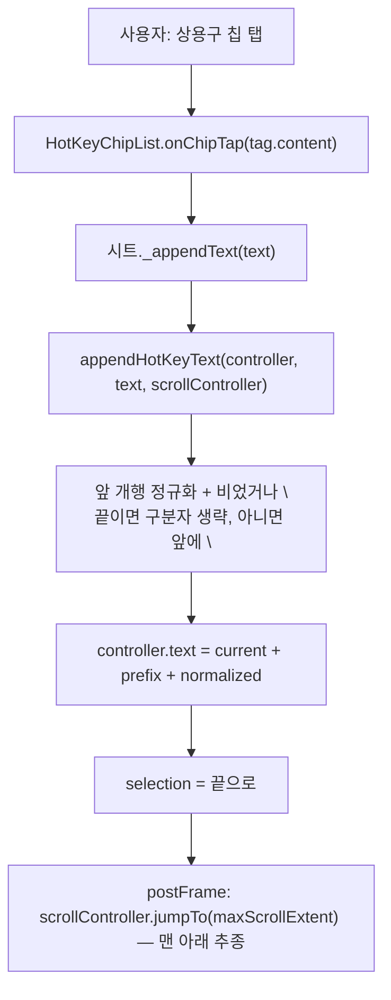
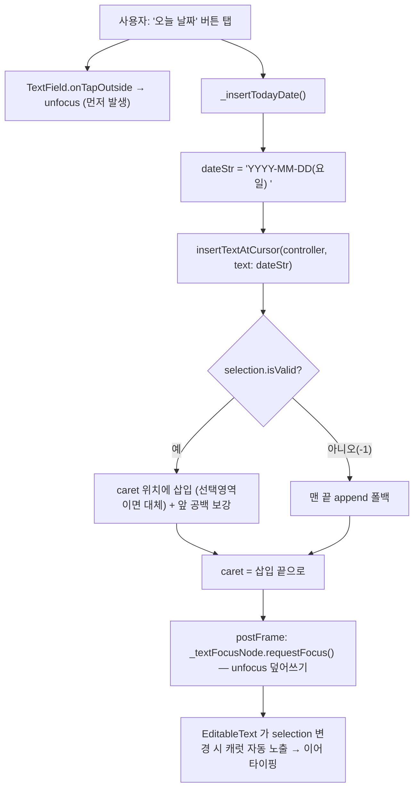
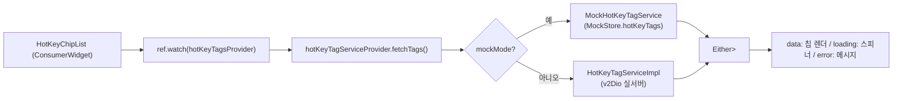

# 2026-06-06 · 진료 작성 시트 텍스트 삽입(상용구 + 오늘 날짜) 프론트 구조 정리

> 유형: 구조 이해 / 기능 구현 정리 (버그 아님)
> 목적: "어디에 무엇을 넣었고, 그게 어디서 어떻게 쓰이는지" + 호출 플로우 파악
> 관련 학습 노트: [[2026-06-06-flutter-cursor-text-insertion]]

---

## 0. 한눈에

진료실의 **작성 바텀시트**(기타/메모/주소증/증상경과)에는 입력칸에 텍스트를 꽂아넣는 2가지 액션이 있다.

| 액션 | 동작 | 삽입 위치 | 헬퍼 |
|------|------|-----------|------|
| **상용구(HotKey) 칩 탭** | 등록된 상용구 원문을 입력 | **맨 끝 append** + 줄바꿈 구분 + 스크롤 끝으로 추종 | `appendHotKeyText` |
| **"오늘 날짜" 버튼** | `2026-06-06(토) ` 삽입 | **현재 커서(캐럿) 위치** (오늘 변경) | `insertTextAtCursor` (신규) |

두 헬퍼 모두 한 파일에 모여 있다 →
[`lib/features/consultation/presentation/widgets/write_sheet/hot_key_text_insertion.dart`](../../../src/devops-mediclo/lib/features/consultation/presentation/widgets/write_sheet/hot_key_text_insertion.dart)

---

## 1. 파일 지도 — 어디에 무엇이 들어있나

```
lib/features/consultation/
├─ data/
│  ├─ models/hot_key_tag.dart                 # HotKeyTag (hotKey 라벨 + content 원문)
│  └─ services/hot_key_tag_service.dart       # 상용구 태그 데이터 소스
│       ├─ HotKeyTagService (abstract)
│       ├─ HotKeyTagServiceImpl   (실서버, v2Dio)
│       ├─ MockHotKeyTagService   (MockStore 기반)
│       ├─ hotKeyTagServiceProvider  (mockMode 분기)
│       └─ hotKeyTagsProvider        (FutureProvider<List<HotKeyTag>>)
│
└─ presentation/widgets/
   ├─ write_sheet/                            # ★ 4개 작성 시트가 공유하는 공통 조각
   │   ├─ write_sheet_scaffold.dart           # 셸: 가로=Row(입력|상용구300), 세로=Column(상용구/입력)
   │   ├─ hot_key_chip_list.dart              # 상용구 칩 목록(Consumer) → onChipTap 콜백
   │   ├─ hot_key_text_insertion.dart         # ★ appendHotKeyText + insertTextAtCursor
   │   └─ auto_save_controller.dart           # 자동저장 mixin (드래프트/디바운스)
   │
   ├─ etc/write_etc_sheet.dart                # 기타  — 상용구 + "오늘 날짜" 버튼(여기만)
   ├─ memo/write_memo_sheet.dart              # 메모  — 상용구
   ├─ jusojung/write_jusojung_sheet.dart      # 주소증 — 상용구
   └─ symptom_progress/write_symptom_progress_sheet.dart  # 증상경과 — 상용구
```

핵심 포인트:
- **공통 조각은 `write_sheet/` 한 폴더**에 모여 있고, 4개 시트가 그걸 조립해서 만든다.
- **`hot_key_text_insertion.dart` = 삽입 로직의 단일 출처(SSOT)**. 시트마다 복붙하지 않는다.
- **"오늘 날짜" 버튼은 기타(etc) 시트에만** 존재한다.

---

## 2. 무엇을 넣었나 (이번 작업: 오늘 날짜 커서 삽입)

### 2-1. `hot_key_text_insertion.dart` — `insertTextAtCursor` 신규 추가

기존 `appendHotKeyText`(맨끝 append)는 그대로 두고, **커서 위치 삽입용 헬퍼**를 새로 추가.

```dart
void insertTextAtCursor(TextEditingController controller, {required String text}) {
  final value = controller.text;
  final sel = controller.selection;

  if (!sel.isValid) {                       // 포커스 없음/selection 유실(-1)
    controller.text = value + text;         // → 맨 끝 append 폴백 (맨 앞 금지)
    controller.selection = TextSelection.collapsed(offset: controller.text.length);
    return;
  }
  final len = value.length;
  final start = sel.start.clamp(0, len);    // stale selection 방어
  final end = sel.end.clamp(0, len);
  final before = value.substring(0, start);
  final after = value.substring(end);

  final needLeadingSpace =                  // 직전 문자가 공백/개행 아니면 앞 공백 보강
      before.isNotEmpty && !before.endsWith(' ') && !before.endsWith('\n');
  final insert = (needLeadingSpace ? ' ' : '') + text;

  controller.value = TextEditingValue(
    text: before + insert + after,
    selection: TextSelection.collapsed(offset: before.length + insert.length),
  );
}
```

### 2-2. `write_etc_sheet.dart` — 배선 변경

- `_insertTodayDate()`: `appendHotKeyText(...)` → **`insertTextAtCursor(...)`**
- **`FocusNode _textFocusNode`** 추가 → `_EtcInputContent → _TextBox → _BottomlessTextArea` 로 전달해 본문 `TextField.focusNode` 에 연결, dispose 추가
- 삽입 직후 **`addPostFrameCallback` 으로 `requestFocus`** — 날짜 버튼 탭이 `TextField.onTapOutside` 로 unfocus 를 먼저 태우므로, 같은 탭의 동기 requestFocus 는 순서가 안 꼬이게 postFrame 으로 미뤄 확실히 덮어쓴다.

> 왜 커서 삽입? 상용구 = "문단 통째 추가"라 맨끝이 자연스럽지만, 날짜 = "타이핑 흐름 속 인라인 마커"라 맨끝으로 날아가면 문맥이 끊긴다. (ui-ux 자문 권고안 B: 커서삽입 + 캐럿 가시화는 EditableText 기본 동작에 위임)

---

## 3. 이게 어디서 어떻게 쓰이나 (활용처)

### 상용구 칩 (`appendHotKeyText`)
4개 시트 모두 동일 패턴:
```dart
// 시트 State 내부
void _appendText(String text) =>
    appendHotKeyText(_controller, text: text, scrollController: _textScrollController);

// build() 에서 공통 셸에 주입
WriteSheetScaffold(
  hotKeySection: HotKeyChipList(onChipTap: _appendText, scrollable: true),
  inputContent: ...,
)
```
→ `HotKeyChipList` 가 칩을 누르면 `onChipTap(tag.content)` 으로 **CUMEMO 원문(개행 포함)** 을 넘기고, 시트는 그걸 `appendHotKeyText` 로 입력칸 끝에 붙인다.

### 오늘 날짜 (`insertTextAtCursor`)
기타 시트의 `_TodayDateButton(onTap: _insertTodayDate)` 한 곳에서만 호출.

---

## 4. 호출 플로우 다이어그램

### 4-1. 상용구 칩 탭 (맨끝 append)



### 4-2. 오늘 날짜 버튼 (커서 위치 삽입 — 이번 변경)



### 4-3. 상용구 데이터 소스 (칩 목록이 채워지는 경로)



---

## 5. 학습 포인트
- 입력 삽입은 **append vs cursor-insert** 두 모드가 맥락에 따라 갈린다. 무지성 통일이 아니라 "문단 추가/인라인 마커" 의도로 구분.
- Flutter 에서 **버튼이 `onTapOutside` 로 포커스를 빼앗는 구조**라면, 재포커스는 `addPostFrameCallback` 으로 미뤄야 unfocus 와 순서가 안 꼬인다.
- 포커스가 있으면 `EditableText` 가 selection 변경 시 캐럿을 자동으로 화면에 노출 → 별도 스크롤 보정 불필요.
- 👉 재사용 개념은 별도 노트로: [[2026-06-06-flutter-cursor-text-insertion]]

---

## 6. 재발 방지 / 주의
- [ ] 삽입 헬퍼는 `hot_key_text_insertion.dart` 한 곳에서만 — 시트에 인라인 복붙 금지
- [ ] 커서 삽입을 다른 시트에도 쓸 일이 생기면 `insertTextAtCursor` 재사용(포커스 보정 패턴 포함)
- [ ] selection 무효(-1) 폴백은 항상 "맨 끝" (맨 앞 삽입은 데이터 훼손)

---

## 7. 질문 기록

### 내가 던진 질문 (원문)
- "아 원래 사용구 클릭하면 어떻게 됫었는지 알아? 그 커서 위치에 글자를 넣었나?"
- "지금은 최하단이거든 원래 어땟는지 알어?"
- "uiux 한테 오늘날짜 삽입만 커서위치로 하도록 할 수 있을까 커서위치였으니까 이미 스크롤은 내가 보고 있는 상황이었겠지?"
- "ui-ux 한테 평가해달라고 해봐 다른 의견 있으면 좋고"
- "일단 커밋"
- "/dev-log 현재 프로젝트의 프론트 부분을 이해하기 위해 현ㄴ재 기능을 구현하기 위해 어디어디 어디에 넣었으며 이는 어디에 활용되고의 내용과 플로우 다이어그램 넣어서 해줘"

### Claude가 되물은 확인 질문 + 답
- Q: 커서 위치 삽입 방식으로 바꾸려는 건가요, 동작 점검인가요? / A: 진행 요청("ㄱㄱ")
- Q: 064 중복 문서(다른 세션이 만든 동일 작업)를 삭제 정리할까요? / A: ❓ 미답

---

## 8. 한 줄 결론
> 진료 작성 시트의 텍스트 삽입은 `write_sheet/hot_key_text_insertion.dart` 가 SSOT이고, **상용구=맨끝 append / 오늘 날짜=커서 위치 삽입**으로 맥락에 맞춰 분기한다.
