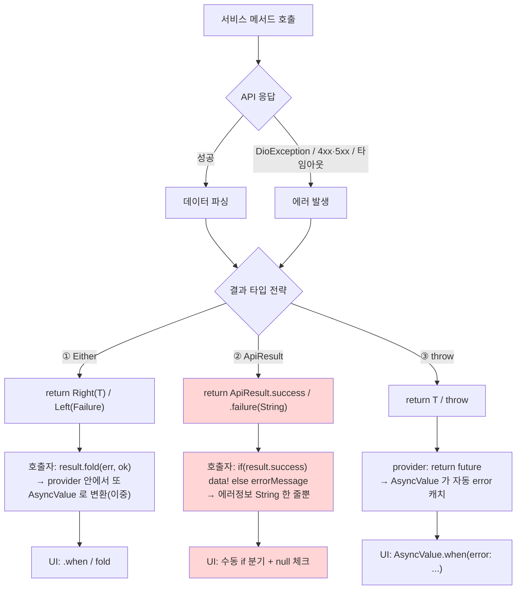

# Flutter 서비스 레이어 결과/에러 타입 전략 (Either vs ApiResult vs throw)

> 한 줄 요약: 서비스 메서드가 "성공/실패"를 호출자에게 어떻게 전달하느냐 — 반환 타입(Either/Result)으로 명시할지, 예외(throw)로 흘릴지 — 의 3가지 방식을 비교하고, Riverpod 기반 코드베이스라면 **단일 sealed `AppException` + throw + AsyncValue** 로 통일하는 것이 가장 응집도가 높다는 결론.

## 핵심

서비스(=data 레이어 API 클라이언트)가 결과를 돌려주는 방식은 크게 두 축이다.

1. **에러를 반환값에 담는다(value-based)** — `Either<Failure, T>`, `Result<T>`, `ApiResult<T>`. 호출자가 분기를 *강제*당한다.
2. **에러를 예외로 던진다(exception-based)** — `Future<T>` 를 그냥 반환하고 실패 시 `throw`. 호출자가 `try/catch`(또는 Riverpod `AsyncValue`)로 잡는다.

mediclo 코드베이스는 이 둘이 **3가지 변종으로 혼재**한다 (2026-06-05 기준, 실측):

| 방식 | 서비스 | 실패 표현 | 소비 방법 |
|------|--------|-----------|-----------|
| `Either<XxxFailure, T>` (fpdart) | auth, hot_key_tag, consultation_progress, status_board, patient_search | 도메인별 `Failure` 클래스 **5종** (`AuthFailure`, `HotKeyTagFailure`, …) | `.fold(onError, onSuccess)` — 12곳 |
| `ApiResult<T>` (core) | consent, config, checkin, address, chart_detail | `{ bool success, T? data, String? errorMessage }` | `if (result.success) …` — 105 호출지점 |
| raw 반환 + `throw` | patient_memo(`List<Dto>`), memo·etc(`Future<Memo>`), patient(`Future<Patient?>`) | `DioException` 그대로 전파 | `FutureProvider` 가 그대로 반환 → `AsyncValue` 가 자동 캐치 |

핵심 관찰:
- **공통 베이스가 없다.** `lib/core` 에 `AppException`/`sealed Failure` 같은 통합 타입이 없어서, `Failure` 클래스 5개가 각자 따로 산다. `AuthFailure` 만 `isDuplicateLogin`·`code`·`status` 같은 **구조화된 필드**를 갖고 나머지는 제각각.
- **`ApiResult` 는 손실이 크다.** 에러를 `String errorMessage` 한 줄로만 담아 상태코드·에러종류·도메인 컨텍스트가 전부 날아간다. `data` 가 성공 시에도 `T?`(nullable) 라 호출자가 매번 null 체크를 강요당한다. 사실상 *손실 버전 Either* 다.
- **throw 방식은 Riverpod 에 가장 자연스럽다.** `memoListProvider` 는 `return service.fetchMemos(...)` 단 한 줄이고, 실패는 `AsyncValue.error` 로 자동 변환된다. 다만 에러 타입이 시그니처에 안 보이고, `DioException` 이 그대로 새서 UI 가 "중복로그인 vs 네트워크 vs 404" 를 구분할 근거가 없다.
- **에러 매핑 지점이 분산.** `_ErrorInterceptor` 는 로깅만 하고 `handler.next(err)` 로 흘려보낸다 → 변환은 각 서비스 `try/catch` 가 제각각 수행.

## 언제 / 왜 쓰나

- **value-based (Either/Result)**: 에러를 *반드시* 다루게 강제하고 싶을 때, 에러가 "비정상"이 아니라 "정상적인 분기"(예: 폼 검증 실패)일 때. 함수형 파이프라인(`flatMap`)을 쓸 때.
- **exception-based (throw)**: 에러가 진짜 예외적(네트워크 끊김, 서버 5xx)이고, 프레임워크(Riverpod `AsyncValue`, Flutter `FutureBuilder`)가 이미 캐치-렌더 경로를 제공할 때. 보일러플레이트를 줄이고 싶을 때.

## 각 방식 장단점

### ① `Either<Failure, T>` (fpdart)
- 👍 에러가 **시그니처에 명시** → 컴파일 타임에 처리 강제. `fold` 안 하면 값을 못 꺼냄.
- 👍 `Failure` 에 구조화 필드(`isDuplicateLogin`) 부여 가능 → UI 분기 가능.
- 👎 호출지점마다 `.fold` 보일러플레이트.
- 👎 **Riverpod 과 이중 래핑.** provider 안에서 `result.fold(...)` 로 풀고 다시 `AsyncValue` 로 넘기면 → 에러 모델이 2층(`Either` + `AsyncValue`)으로 쌓인다. (`consultation_progress_provider` 가 실제로 provider 안에서 fold 중.)
- 👎 fpdart 의존 + `Failure` 클래스가 도메인마다 늘어남(현재 5종, 공통 베이스 없음).

### ② `ApiResult<T>` (자체 구현)
- 👍 fpdart 의존 없음, 단순.
- 👎 **sealed 아님** → 컴파일러가 success/failure 분기 누락을 못 잡음.
- 👎 **에러 정보 손실** — `String` 한 줄. 상태코드·종류 소실 → UI 분기 불가.
- 👎 성공 시 `data` 가 `T?` → 불필요한 null 체크 전파.
- 👎 사실상 Either 의 열화판. 얻는 게 거의 없다. **제거 1순위.**

### ③ raw 반환 + throw
- 👍 **가장 적은 코드.** provider 가 future 를 그대로 반환.
- 👍 Riverpod `AsyncValue.when(loading/error/data)` 와 1:1 — 프레임워크가 캐치/로딩/리트라이 다 제공.
- 👎 에러 타입이 **시그니처에 안 보임** → 규율 의존.
- 👎 타입 매핑이 없으면 `DioException` 이 UI 까지 그대로 샘 → 에러 종류 구분 불가, 메시지 노출 위험.

## 플로우 다이어그램



ASCII 폴백:

```
                       서비스 메서드
                            │
                ┌───────────┴───────────┐
              성공                     에러(DioException/4xx·5xx)
                └───────────┬───────────┘
                       결과 타입 전략
        ┌───────────────────┼────────────────────┐
   ① Either              ② ApiResult            ③ throw
 Right/Left(Failure)   success/.failure(String)   T / throw
        │                   │                      │
   .fold(err,ok)        if(success) data!      provider: return future
   +AsyncValue(이중)     +String 한 줄(손실)     +AsyncValue 자동캐치
        │                   │                      │
   UI .when/fold        UI 수동 if+null체크 ✗     UI AsyncValue.when ✓
```

## 통일 추천: 단일 sealed `AppException` + throw + Riverpod `AsyncValue`

이 코드베이스는 **Riverpod `FutureProvider`/`AsyncValue` 가 이미 전 화면의 로딩·에러 렌더 경로**다. 그렇다면 결과 타입을 또 만들 이유가 약하다. 추천:

1. **`lib/core/errors/app_exception.dart` 에 sealed `AppException` 1개** 로 5종 `Failure` 를 흡수.
   ```dart
   sealed class AppException implements Exception {
     const AppException(this.message, {this.code, this.statusCode});
     final String message; final String? code; final int? statusCode;
   }
   class NetworkException extends AppException { ... }   // 타임아웃·연결끊김
   class ServerException  extends AppException { ... }   // 4xx·5xx
   class AuthException    extends AppException {          // 인증 도메인
     const AuthException(super.m,{this.isDuplicateLogin=false, super.code});
     final bool isDuplicateLogin;   // 기존 AuthFailure.isDuplicateLogin 보존
   }
   class UnknownException extends AppException { ... }
   ```
2. **변환을 한 곳으로** — `_ErrorInterceptor` 또는 공용 `runCatching<T>()` 헬퍼에서 `DioException → AppException` 매핑을 단일화. 각 서비스 `try/catch` 의 중복 매핑 제거.
3. **서비스는 `Future<T>` 를 그냥 반환하고 실패 시 `AppException` throw.** `ApiResult` / `Either` 전부 제거.
4. **provider 는 future 를 그대로 반환**(또는 `AsyncValue.guard`). UI 는 `asyncValue.when(error: (e,_) => switch(e as AppException){ AuthException a when a.isDuplicateLogin => …, … })` 로 **타입 분기**.

### 왜 이게 최적인가
- Either 의 핵심 가치(에러를 *반드시* 다룸)는 `AsyncValue.when` 이 UI 에서 `error:` 콜백을 사실상 강제하므로 **상당 부분 보존**된다.
- `ApiResult` 의 정보 손실/nullable 문제 **완전 제거**.
- `Failure` 5종 → sealed 1계층 → `switch` exhaustive 체크로 **컴파일 타임 분기 안전성 회복** (`AuthFailure.isDuplicateLogin` 같은 분기 요구사항 충족).
- provider 코드가 `return service.xxx()` 수준으로 단순 — 이중 래핑(Either+AsyncValue) 해소.
- fpdart 의존 축소.

### 대안 (팀이 "에러를 시그니처에 보이는 것" 을 더 중시하면)
- **프로젝트 소유 `Result<T>` (sealed) + 단일 `AppFailure` (sealed)** 로 통일하고 fpdart `Either` 와 `ApiResult` 를 모두 흡수. 단 이 경우 **provider 에서 또 `AsyncValue` 로 이중 래핑하지 말 것** — 경계를 하나로 정해야 한다(`AsyncValue<Result<T>>` 금지, `Result` 를 풀어 `AsyncError` 로 매핑하든지 택일).
- 이 길은 명시성 ↑ 보일러플레이트 ↑. Riverpod 친화성은 ①보다 낮음.

### 마이그레이션 경로 (점진적, 한 번에 X)
1. `AppException` sealed + `runCatching`/interceptor 매핑 도입 (신규 코드부터).
2. **`ApiResult` 부터 제거** — 가장 가치 없고 위험(정보손실). consent/config/checkin/address/chart_detail 순.
3. `Either` 서비스(auth 등)는 안정적이므로 후순위 — `Left(AuthFailure)` → `throw AuthException` 으로 치환, `.fold` 호출지점을 `AsyncValue.when` 로.
4. raw+throw(memo/etc/patient)는 이미 목표형에 가까움 → `DioException` 대신 `AppException` 던지도록 매핑만 추가.

## 흔한 함정 / 헷갈리는 점

- **이중 에러 모델.** `AsyncValue<Either<F,T>>` 처럼 두 에러 컨테이너를 겹치면 처리가 두 번 갈라진다. 경계(boundary)를 *한 곳*으로 정해라.
- **`ApiResult.data` 가 성공인데도 `T?`** — sealed 가 아니면 컴파일러가 "성공=데이터있음" 을 보장 못 한다. 매번 `!`/null 체크가 새는 이유.
- **throw 방식은 매핑이 없으면 위험** — `DioException` 메시지가 UI 까지 그대로 노출될 수 있다. 반드시 단일 매핑 지점에서 `AppException` 으로 바꿔라.
- **fpdart `Either` 의 `fold` 인자 순서** — `(onLeft, onRight)` = `(실패, 성공)`. 뒤집으면 조용히 버그.

## 질문 기록
> 이 항목은 항상 채운다(원칙 8).

### 내가 던진 질문 (원문)
- "현재 프로젝트에서 다음과 같이 혼합해서 사용하고 있는데 각 구조의 장단점이 어떻게 되고 통일을 한다면 어떤 구조로 통일하는 것이 좋은지 플로우 다이어그램과 함께 만들어줄래? ① 결과/에러 타입 (가장 큰 분기) — 3가지 혼재 … Either<XxxFailure, T> (fpdart) / ApiResult<T> (core) / raw 반환 + throw"

### Claude가 되물은 확인 질문 + 답
- (이번 세션에 되물은 확인 질문 없음 — 코드베이스를 직접 실측하여 사실 확인함: `ApiResult` 정의 `lib/core/network/api_client.dart:195`, `Failure` 5종, `.fold` 12곳, `ApiResult.success/failure` 105 호출지점, `memoListProvider` raw 반환 확인)

## 관련
- 발단이 된 프로젝트: mediclo (병원 EMR 태블릿 앱, Flutter + Riverpod)
- 관련 코드: `lib/core/network/api_client.dart` (`ApiResult`, `_ErrorInterceptor`), `lib/features/auth/data/services/auth_service.dart` (`AuthFailure`/Either), `lib/features/consultation/presentation/providers/memo_providers.dart` (raw+throw)
- 인접 이슈: [[2026-06-05-dio-throwaway-interceptor-session-expiry]]
- 참고: Riverpod `AsyncValue.guard` / `.when`, fpdart `Either`

---
- 생성일: 2026-06-05
- 마지막 갱신: 2026-06-05
